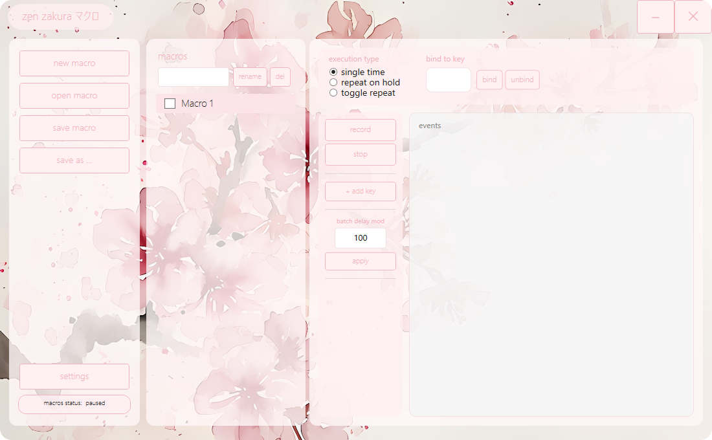

<p align="center">
  
</p>

<h1 align="center">zen zakura マクロ</h1>
<h3 align="center">Zen Zakura Macro — elegant keyboard macro recorder & player for Windows</h3>

<p align="center">
  
  
  
  
</p>

<br />

**Zen Zakura Macro** is a keyboard macro recorder and player with hotkey binding, inspired by Japanese minimalist aesthetics. It combines a native C++ core for low-level input handling with a clean WPF UI built on .NET 9.

---

## 桜 Features

### Recording & Editing
- **Real-time recording** — captures keyboard events with precise timing between keystrokes
- **Manual editing** — add, remove, reorder events; edit individual delays; drag-and-drop reordering
- **Batch delay** — apply a single delay value to all events at once

### Playback Modes
| Mode | Description |
|------|-------------|
| **Single time** | Executes once when the hotkey is pressed |
| **Repeat on hold** | Loops continuously while the hotkey is held down |
| **Toggle repeat** | One press starts an infinite loop; another press stops it |

### Hotkeys
- **Bind any key** — letters, numbers, F1–F12, Caps, Tab, Space, Enter, Backspace, arrows, Shift/Ctrl/Alt
- **Automatic blocking** — bound keys are consumed by the hook and never reach the system
- **Caps Lock handling** — synthetic undo ensures the system toggle state stays correct
- **Unbind** — remove a binding with one click

### Global Pause / Resume
- Configurable hotkey (Settings → global pause toggle key)
- Instantly pauses all macros and stops current playback
- Press again to resume
- **Status indicator** in the sidebar — `macros status: active` / `macros status: paused`, polling every 500ms

### Process-Aware Filter (#IfWinActive style)
- **Per-process filtering** — macros only fire when a chosen window is in the foreground
- Switching away automatically pauses all macros
- Switching back automatically resumes them
- Combo box lists all running processes for easy selection

### Macro Management
- **Create, rename, delete** macros
- **Save / Open** — native `.zmacro` format (JSON)
- **Per-macro hotkey toggle** — enable/disable each macro's hotkey independently via checkbox
- **File-backed** — macros are linked to files on first save; subsequent saves write in-place
- **Drag-and-drop** event reordering within the editor

### Interface
- Frameless custom window with minimize / close buttons
- Sakura blossom background
- Minimize to system tray with context menu (Show / Exit)
- Double-click tray icon to restore window
- Drag the window by its title area

### Persistence
- Settings saved to `%LOCALAPPDATA%/ZenZakura/settings.json`
- Macros stored as `.zmacro` files in `Macros/` next to the executable

---

## 桜 Use Cases

| Scenario | Description |
|----------|-------------|
| 🎮 **Gaming macros** | Automate complex key sequences in MMOs, MOBAs, and fighting games. Process filter ensures macros only fire in-game |
| ⌨️ **Productivity** | Speed up repetitive input — login forms, canned responses, templates |
| 🎨 **Design / editing** | Insert common hotkey sequences for Photoshop, After Effects, Blender |
| 💻 **Development** | Automate IDE actions, console commands, boilerplate snippets |
| 🏢 **Office** | Data entry, spreadsheet automation, CRM workflows |
| 🔁 **AFK loops** | Cyclic actions with configurable delay via Toggle Repeat mode |

---

## 桜 Quick Start

### Download
[Latest release](https://github.com/prfctcondition/zen-zakura-macro/releases) — Prebuilt .zip and Inno Setup Installer.

### Build from source
Requirements: Visual Studio 2022+ (C++ workload), .NET 9 SDK.

```bash
# Open Developer Command Prompt for VS 2022+

msbuild ZenZakuraCore\ZenZakuraCore.vcxproj /p:Configuration=Release /p:Platform=x64

dotnet publish ZenZakuraUI\ZenZakuraUI.csproj -c Release -o bin\Release

# Copy assets
copy ZenZakuraCore\x64\Release\ZenZakuraCore.dll bin\Release\
copy app.ico bin\Release\
copy sakura_bg.png bin\Release\
md bin\Release\Macros
```

See `BUILD.md` for details.

---

## 桜 Tech Stack

```
┌─────────────────────────────────┐
│  ZenZakuraUI.exe (WPF / C#)     │
│  .NET 9, MVVM, CommunityToolkit │
├─────────────────────────────────┤
│  ZenZakuraCore.dll (C++)        │
│  WinAPI, LL keyboard hook,      │
│  high-res timer, SendInput      │
└─────────────────────────────────┘
```

- **Core** — C++, low-level `WH_KEYBOARD_LL` hooking, `QueryPerformanceCounter`-based timing, real-time input processing
- **UI** — WPF (.NET 9), MVVM pattern, CommunityToolkit.Mvvm, custom styles, Lexend Tera font
- **Interop** — P/Invoke, `stdcall` callbacks from C++ to C#, `SendInput` for key emulation
- **Build** — MSVC + dotnet CLI

---

## 桜 Project Structure

```
zen-zakura-macro/
├── ZenZakuraCore/          # C++ engine
│   ├── src/                # HookEngine, PlaybackEngine, BindingEngine, Timing
│   ├── include/            # Public API (ZenZakuraCore.h)
│   └── ZenZakuraCore.vcxproj
├── ZenZakuraUI/            # WPF frontend
│   ├── Models/             # Macro, KeyEvent, PlaybackMode
│   ├── ViewModels/         # MainViewModel, SettingsViewModel
│   ├── Views/...           # MainWindow, SettingsWindow
│   ├── Services/           # CoreInterop, MacroStorage, TrayService
│   ├── Converters/         # BoolToPauseState, NullToVisibility
│   └── Themes/             # Colors.xaml, Styles.xaml
├── build.ps1               # Build script
├── BUILD.md                # Build instructions
└── README.md               # This file
```

---

## 桜 License

MIT. Do whatever you want.

---

<p align="center">
  <sub>made in 3 hours so yeahh idk</sub>
</p>
